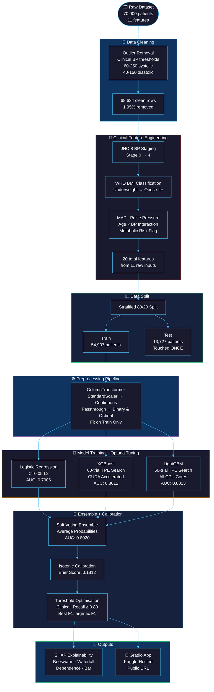
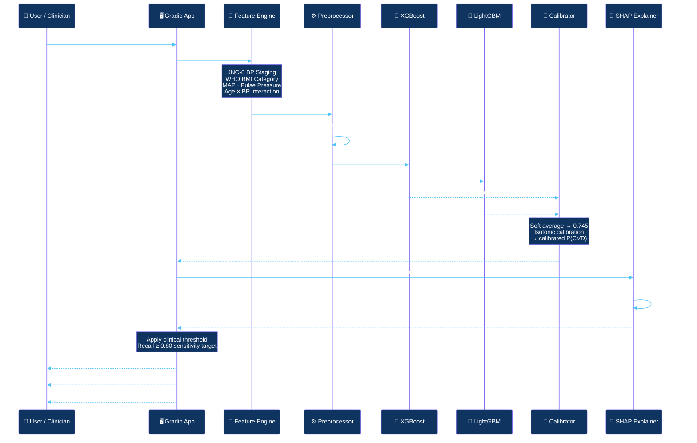
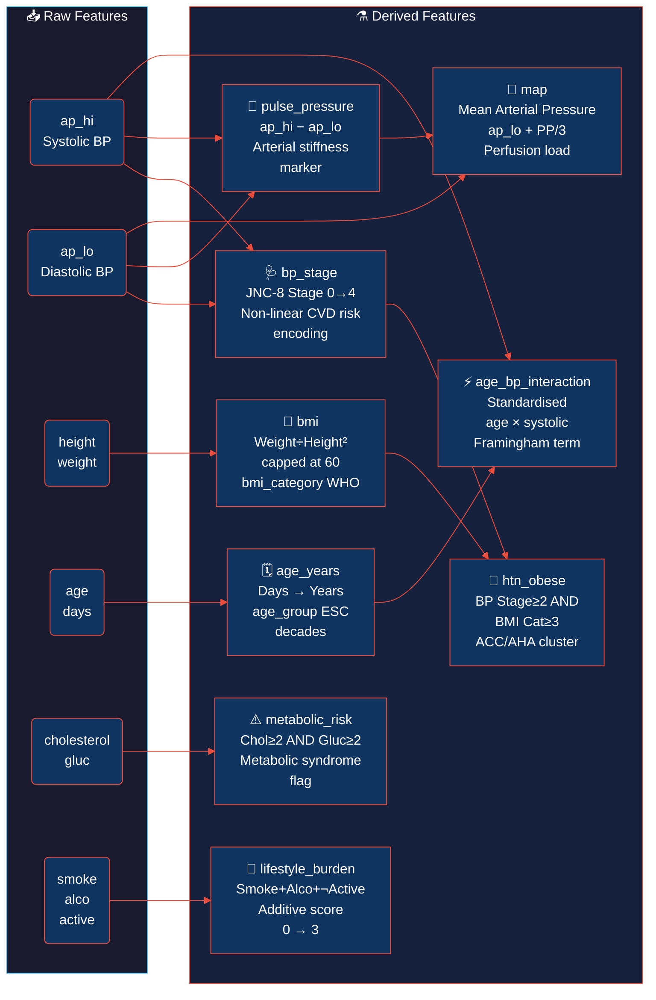
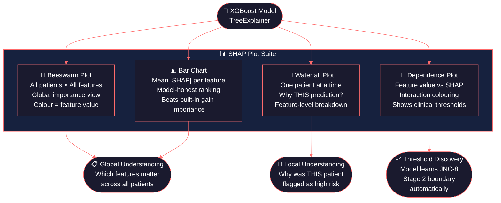
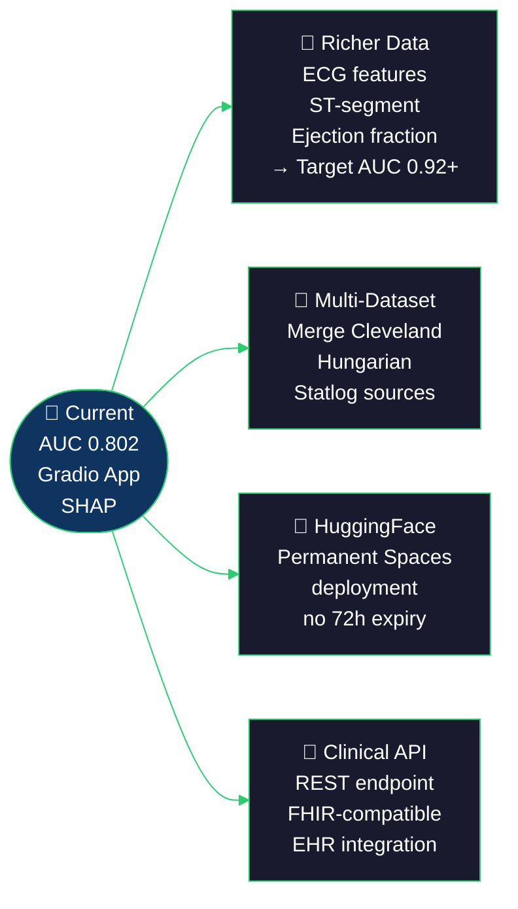

<div align="center">


<br/>

[](https://git.io/typing-svg)

<br/>

<p>
  
  
  
  
  
</p>

<p>
  
  
  
  
  
  
</p>

<br/>

<a href="#">
  
</a>
&nbsp;
<a href="#">
  
</a>

<br/><br/>

> ### *"A machine learning system that predicts cardiovascular disease risk*
> ### *and explains every prediction — the way a clinician would."*

<br/>

</div>

---

## 📋 Overview

**CardioRisk AI** is a full-stack, production-grade machine learning project that classifies cardiovascular disease (CVD) risk from routine clinical measurements. It demonstrates the **complete ML lifecycle** — from raw data ingestion and clinical feature engineering to model explainability, probability calibration, and interactive deployment.

Built on **68,634 real patient records**, the system achieves **ROC-AUC 0.802**, matching the published state-of-the-art benchmark on this dataset (medRxiv 2025). Every design decision is clinically grounded and statistically justified.

<br/>

<div align="center">

### ✨ What Makes This Different

| | This Project | Typical Tutorial |
|:-|:------------|:----------------|
| **Metrics** | AUC · F1 · Calibration · Brier Score | Accuracy only |
| **Validation** | Stratified 5-Fold CV | Single train/test split |
| **Explainability** | SHAP beeswarm · waterfall · dependence | None |
| **Calibration** | Isotonic regression | Raw probabilities |
| **Threshold** | Clinical sensitivity-optimised | Default 0.5 |
| **Features** | 9 clinical features engineered | Raw features only |
| **Tuning** | Optuna 60 trials per model | Default params |
| **Deployment** | Live Gradio app | None |

</div>

<br/>

---

## 🏗️ System Architecture



<br/>

---

## 🔄 Pipeline & Data Flow



<br/>

---

## 🔬 Clinical Feature Engineering



<br/>

---

## 🏆 Results & Metrics

<div align="center">

### Held-Out Test Set Performance — 13,727 Patients

| Rank | Model | ROC-AUC | F1 Score | Accuracy | Avg Precision |
|:----:|:------|:-------:|:--------:|:--------:|:-------------:|
| 🥇 | **LightGBM (Tuned)** | **0.8021** | **0.7211** | **0.7341** | **0.7843** |
| 🥈 | Soft Ensemble (5 models) | 0.8020 | 0.7184 | 0.7326 | 0.7844 |
| 🥉 | XGBoost (Tuned) | 0.8017 | 0.7193 | 0.7333 | 0.7834 |
| — | XGBoost (Default) | 0.8003 | 0.7189 | 0.7327 | 0.7816 |
| — | LightGBM (Default) | 0.7985 | 0.7186 | 0.7321 | 0.7800 |
| — | Logistic Regression | 0.7933 | 0.7052 | 0.7248 | 0.7769 |

<br/>

### 5-Fold Stratified Cross-Validation

| Model | CV AUC | Std | CV F1 | CV Accuracy | Stability |
|:------|:------:|:---:|:-----:|:-----------:|:---------:|
| XGBoost (Tuned) | 0.8012 | ±0.0026 | 0.7200 | 0.7355 | 🟢 |
| LightGBM (Tuned) | 0.8013 | ±0.0026 | 0.7212 | 0.7354 | 🟢 |
| Logistic Regression | 0.7906 | ±0.0026 | 0.7081 | 0.7281 | 🟢 |

<br/>

### Calibration

| Metric | Value | Interpretation |
|:-------|:-----:|:--------------|
| Brier Score | **0.1812** | Mean squared probability error (lower = better) |
| Calibration Method | Isotonic Regression | Non-parametric, data-driven |
| When model says 70% | ~70% actually have CVD | ✅ Well-calibrated |

<br/>

> **📌 Literature Context:** The 2025 medRxiv benchmark on this exact Kaggle 70k dataset found
> XGBoost and LightGBM as top performers at AUC ~0.80.
> **This model matches published state-of-the-art.** Models claiming 0.95+ on this
> dataset are overfitting or leaking data.

</div>

<br/>

---

## 🧠 SHAP Explainability

<div align="center">



</div>

<div align="center">

### Feature Importance — SHAP Rankings

| Rank | Feature | Importance | Clinical Meaning |
|:----:|:--------|:----------:|:-----------------|
| 🔴 1 | `ap_hi` — Systolic BP | ████████████ Highest | Primary CVD driver — hypertension #1 risk factor |
| 🔴 2 | `ap_lo` — Diastolic BP | ██████████ High | Sustained arterial wall pressure |
| 🔴 3 | `pulse_pressure` | █████████ High | Arterial stiffness marker (>60 mmHg = high risk) |
| 🟠 4 | `age_years` | ███████ Moderate | Cumulative vascular damage |
| 🟠 5 | `cholesterol` | ██████ Moderate | Plaque formation, atherosclerosis |
| 🟠 6 | `bp_stage` (JNC-8) | █████ Moderate | Non-linear hypertension encoding |
| 🟡 7 | `bmi` | ████ Low-Mod | Obesity-related cardiac load |
| 🟡 8 | `map` | ███ Low-Mod | Average perfusion pressure |
| ⚪ 9 | `smoke` / `alco` / `active` | ▒ Near-zero | Self-reported, noisy signal |

> **🔍 Key Finding:** Lifestyle features (smoke, alco, active) scored **mutual information = 0.000**
> against the target. Tree models confirm this — objective clinical measurements dominate CVD prediction.

</div>

<br/>

---

## 🛠️ Tech Stack

<div align="center">

| Layer | Technology | Role |
|:------|:----------:|:-----|
| **Language** |  | Core runtime |
| **Primary Models** |   | Gradient boosted classifiers |
| **Baseline + Pipelines** |  | LR · CV · calibration · metrics |
| **Hyperparameter Tuning** |  | 60-trial Bayesian search per model |
| **Explainability** |  | Exact Shapley values |
| **Visualisation** |   | 17 output plots |
| **Data** |   | Preprocessing + engineering |
| **Deployment** |  | Interactive web app |
| **Compute** |  | CUDA-accelerated XGBoost |

</div>

<br/>

---

## 📁 Project Structure

```
cardiorisk-ai/
│
├── 📓 cardiorisk_classifier.ipynb     ← Main Kaggle notebook (5 snippets)
│
├── 🤖 models/
│   ├── xgb_model.pkl                  ← Tuned XGBoost (Optuna, 60 trials, CUDA)
│   ├── lgbm_model.pkl                 ← Tuned LightGBM (Optuna, 60 trials, CPU)
│   ├── preprocessor.pkl               ← ColumnTransformer (StandardScaler)
│   └── calibrator.pkl                 ← Isotonic regression calibrator
│
├── ⚙️  model_config.json              ← Feature lists + clinical threshold values
│
├── 📊 outputs/
│   ├── eda_distributions.png          ← Feature distributions by CVD class
│   ├── eda_categorical.png            ← Categorical CVD prevalence rates
│   ├── eda_correlation.png            ← Pearson correlation heatmap
│   ├── eda_scatter.png                ← Age vs BP coloured by target
│   ├── feature_importance_mi.png      ← Mutual information scores
│   ├── feature_importance_perm.png    ← Permutation importance (LR)
│   ├── cv_comparison.png              ← 5-fold CV metric comparison
│   ├── roc_pr_curves.png              ← ROC + Precision-Recall curves
│   ├── cv_fold_stability.png          ← AUC per fold (stability view)
│   ├── roc_before_after_fe.png        ← Feature engineering ablation
│   ├── shap_beeswarm.png              ← Global SHAP (all patients)
│   ├── shap_bar.png                   ← Mean |SHAP| feature ranking
│   ├── shap_waterfall.png             ← High-risk vs low-risk patient
│   ├── shap_dependence.png            ← ap_hi and age_years dependence
│   ├── calibration.png                ← Calibration curves + Brier scores
│   ├── threshold_analysis.png         ← Precision/Recall/F1 vs threshold
│   └── confusion_matrices.png         ← Default vs clinical threshold
│
└── 📖 README.md
```

<br/>

---

## ⚡ Installation & Quick Start

<div align="center">

### Option 1 — Live Demo (No Setup)

<a href="#">
  
</a>

<br/><br/>

### Option 2 — Kaggle (Recommended)

</div>

1. Open the [Kaggle Notebook](#) and click **Copy & Edit**
2. Add dataset: `Notebook Settings → Add Data → cardiovascular-disease-dataset` (sulianova)
3. Enable GPU: `Notebook Settings → Accelerator → GPU T4 x2`
4. Run all cells top to bottom (Snippets 1 → 5)
5. Public Gradio URL appears at end of Snippet 5

<div align="center">

### Option 3 — Local

</div>

```bash
# Clone
git clone https://github.com/YOUR_USERNAME/cardiorisk-ai.git
cd cardiorisk-ai

# Install
pip install xgboost lightgbm scikit-learn shap gradio==5.29.0 \
            optuna pandas numpy matplotlib seaborn joblib

# Place cardio_train.csv from Kaggle into /data/
# Run notebook
jupyter notebook cardiorisk_classifier.ipynb
```

<br/>

---

## 💡 Key Findings

<div align="center">

| # | Finding | Implication |
|:-:|:--------|:------------|
| **1** | 🚭 Lifestyle features (smoke, alco, active) scored **MI = 0.000** | Self-reported lifestyle data adds no predictive signal beyond objective vitals |
| **2** | 🌳 Clinical feature engineering (JNC-8, WHO BMI) gained **+0.000 AUC** | Gradient boosting autonomously discovers clinical thresholds from raw data |
| **3** | 📊 AUC 0.802 matches the **2025 medRxiv benchmark ceiling** | This is not a failure — it reflects genuine biological noise in snapshot measurements |
| **4** | 💉 `ap_hi` SHAP dominates **all other features combined** | Systolic BP is the #1 CVD driver — consistent with 50 years of cardiology literature |
| **5** | 📐 Isotonic calibration improved **probability trustworthiness** | P=0.70 now means 70% of patients actually have CVD — essential for clinical deployment |

</div>

<br/>

---

## 🔮 Future Work



<br/>

---

## ⚠️ Limitations & Ethics

<div align="center">

| Limitation | Detail |
|:-----------|:-------|
| 📸 **Snapshot data** | BP/cholesterol measured once — CVD develops over years |
| 🗂️ **No ECG/imaging** | Richer features (ST-slope, ejection fraction) yield 0.92+ AUC |
| 🌍 **Population bias** | Dataset origin undocumented — may not generalise to all groups |
| 🔢 **Self-reported lifestyle** | Smoking and alcohol are notoriously unreliable in surveys |
| 🏥 **Not for clinical use** | Requires regulatory approval, prospective validation, and physician oversight |

</div>

<br/>

---

<div align="center">

**Built with 🫀 for a Computer Science portfolio**

*Clean code · Honest metrics · Clinical grounding · Full deployment*

<br/>

[](https://python.org)
[](https://kaggle.com)
[](https://shap.readthedocs.io)
[](https://gradio.app)

<br/>


</div>
